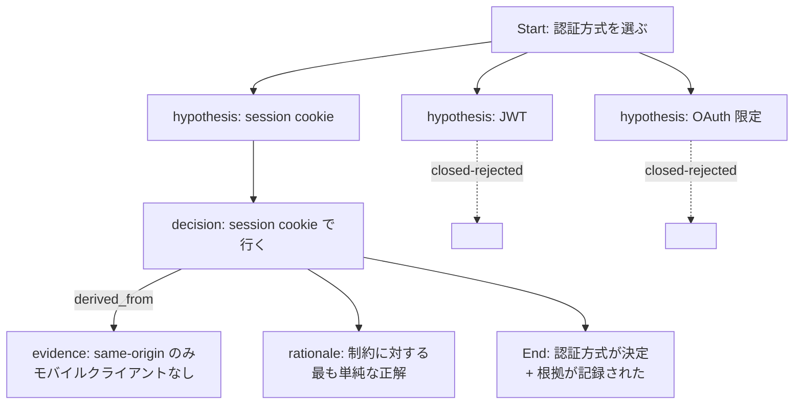
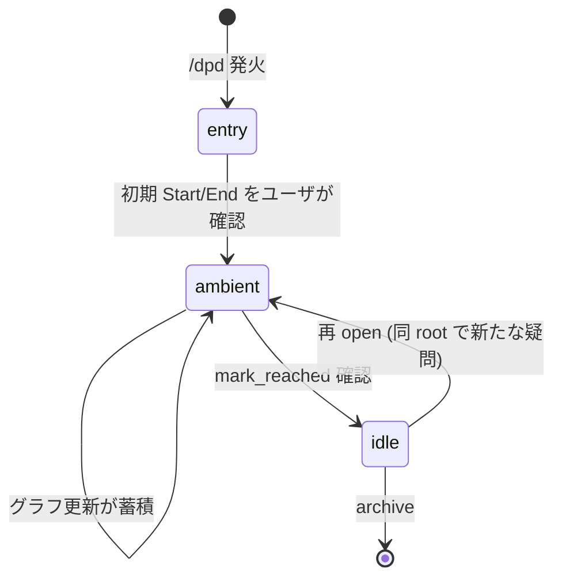

# DPD — Decompose-Propagate Decision

[English](README.md)

AI との意思決定対話を構造化するためのグラフベース・プロトコル。

DPD は AI エージェントとの長く枝分かれする対話を、明示的な意思決定グラフに変換する。仮説はノードとして parking され、決定は根拠となった evidence にリンクされ、対話そのものが「形」を持つようになる — context リセットや resume を跨いでも消えない形を。

このリポジトリは reference 実装で構成される: グラフを SQLite に格納する MCP (Model Context Protocol) サーバと、その上に対話 UX を提供する Claude Code skill。

> **Status**: `0.x` — 実用段階だが 1.0 前。プロトコル / MCP tool surface / sqlite スキーマは backward-compat shim 抜きで変更されうる。[Versioning](#versioning) 参照。

---

## なぜ DPD?

AI コーディング・エージェントを non-trivial な作業に使ったことがあるなら、以下のいずれかは経験済みのはず:

- エージェントと一緒に仮説を 3 つ出して 1 つを選んだが、残り 2 つはトランスクリプトに埋もれて、どれが採用されたかすら追えなくなった。
- 3 時間前にゴールを合意したが、作業はずれていき、誰もそれに気付かない — drift する基準がないから。
- セッションが compact されて、重要な決定の根拠が消えた。
- 同じ質問が繰り返し浮上する — 「もう決着済み」を記録する共有の場がないから。

DPD の主張: これらはすべて「対話を flat なストリームとして扱う」ことの症状で、実態は「意思決定の有向グラフ」である。グラフを明示すれば症状は消える。

---

## DPD はどう動くか (Readable Spec)

DPD は対話を **session** としてモデル化し、その中に 1 つ以上の **root** (top-level の subgraph) を持つ。各 root は次を含む:

- **Start** ノード (問題の宣言)
- **End** ノード (達成条件 — 「完了」とは何か)
- 中間ノード: **hypothesis** / **decision** / **rationale** / **question** / **evidence** …
- ノード間の **edge**: `derived_from` / `contributes_to` / `blocks` …

典型的な意思決定分岐の例:



却下された仮説は消えない — `closed` としてグラフに残るので、「待って、X は検討した？」という未来の質問にちゃんと答えられる。

### Session lifecycle

Session は 3 つのモードを遷移する:



- **entry** — bootstrap フェーズ: ゴールを合意し、初期 Start → End の骨格を作り、既存の対話素材を分類する。
- **ambient** — 定常状態: ユーザは普通に対話を続け、エージェントはバックグラウンドで観察し、自然な区切りで graph 更新を *提案* する (「ここまでの 5 分で記録したいのはこれです、適用しますか?」)。custodial なトーン、transactional ではない。
- **idle** — End 条件が達成され root が settle した状態。明示的に reopen しない限り追加しない。

### Pool (parking lot)

すべての観察が明確な attach 先を持つわけではない。**Pool** は「どこに付けるか不明」な item を一時 park する unstructured な場所。Pool item は後で以下のように扱える:

- **Elevate** — 既存ノードへの explicit edge と共にグラフに昇格
- **Reject** — 理由を記録して却下 (以後エージェントは同じ提案を再発しない)
- **Drop** — 判断せずに削除

Item は canonical text hash で重複判定されるので、「これ前に却下したのと同じ」が detectable で、nag にならない。

### End 絞り込みと drift gate

**End** は subgraph の anchor。skill は entry 時に積極的に End を *narrow* する — ゴール文に 3 つ以上の outcome が混在していたら、End 分割を提案する。End が narrow であるほど drift 検出の精度が上がる。

確定後、End は **gated**: エージェントは `achievement_conditions` を勝手に拡張したり text を書き換えたりしない。変更には明示的なユーザ確認が必要。これが「エージェントが暗黙裡に End を再定義して既に終わった作業に整合させる」という failure mode を防ぐ。

---

## DPD で、Agent-Driven に作られた

この実装はちょっと変わったループで開発された: プロトコル設計そのものが *DPD session で自身の設計判断を記録しながら* 進められた。上で説明した hypothesis 却下 / evidence リンク / End 絞り込み / drift 検出 のメカニズムを、メンテナ (と協働した AI エージェント) が DPD 自体の仕様判断に使った。

具体的には:

- v0.3 → v0.3.1 の修訂サイクルは DPD session として走った。ambient モードのトリガー条件、Pool semantics、End 変更ルールに関する open hypothesis はノードとして attach され、却下されたバリエーションは履歴グラフに残っている。
- 「End modification gate」(dev spec §5.0) は、self-validation 実行中にエージェントが既に drift した作業に合わせて End を黙って拡張していたケースを surface した *後で* 追加された。
- いくつかの「self-check」ルール (例: 「N≥3 の異なる懸念を 1 ノードに flatten する前に sub-tree を検討する」) は、開発 session 中にエージェント自身の failure mode を観察して導出された。

これは余興ではない — プロトコルの意図的な試験だ。自分自身の設計対話を構造化できないなら、人の対話を構造化する資格はない。あのループから生まれたグラフは、初期 draft の gap を発見するための手段でもあった — 現実装が閉じているのはまさにその gap だ。

---

## ユースケース

DPD が真価を発揮する場面:

- **対話が探索的で、複数の有望なブランチがある**、かつ「他のブランチを選ばなかった理由」を後から見たい。
- **session が日を跨ぐ / 別の人が resume する**、かつ「X について何を決めたか」がトランスクリプトを掘る作業ではなく実際の答えとして欲しい。
- **作業がユーザの気にする trade-off を含む** (アーキテクチャ選定、スコープ削減、ポリシー判断) — DPD は trade-off を可視化し、エージェントに黙って選ばせない。
- **どの evidence がどの決定を支えたかの paper trail が欲しい** — review や compliance 用途。

DPD が大袈裟になる場面:

- 機械的でよく specified なタスク (とにかくコードを書く、で済む)
- 短く single-thread な対話
- resume も audit も気にしない

---

## Quick start

Python 3.11+、[Claude Code](https://docs.anthropic.com/en/docs/claude-code) (CLI)、`make` が必要。

```bash
git clone https://github.com/o3co/agent-dpd.git
cd agent-dpd
make dev          # venv インストール + Claude Code への登録
```

新しい MCP サーバを認識させるため Claude Code を再起動。あとはどのプロジェクトからでも `/dpd` を発火すればよい。skill がプロジェクトを検出し、既存 session を resume するか新規 session を始めるかを尋ね、Start → End の anchor 構築まで案内する。

Make を使えない環境向けの手動手順は [AGENTS.md](AGENTS.md#setup) に。

### Optional: workspace のスコープ設定

複数の sibling プロジェクトディレクトリで同じ DPD DB を共有したい場合 (例: 複数の sub-project を持つ monorepo)、workspace ルートに `.dpdrc` を置く:

```ini
# .dpdrc — DPD scope marker
scope=my-workspace
```

MCP サーバはエディタの cwd から walk-up してこの marker を探し、marker の位置を agent-scope ルートとして使う。session とそのグラフは agent-scope ごとに保存される。

agent scope 内で sub-scope (sub-project ごとに session pool を分けたい) を切りたい場合、tree の下層に別の `scope=` 値を持つ `.dpdrc` を置く。詳細は [AGENTS.md](AGENTS.md#sub-scope-detection-dpdrc) を参照。

---

## リポジトリ構成

```text
.
├── mcp/        MCP サーバ (Python, stdio, sqlite) — graph state + tool API
├── skill/      Claude Code skill — 対話 UX
├── docs/       Migration guide、ADR、補足 spec
├── Makefile    install / test / register の便利 target
├── AGENTS.md   開発ガイドライン (contribute 前に読む)
└── LICENSE     Apache 2.0
```

`mcp/` と `skill/` は同時に進化する設計 — skill は server の MCP tool API を消費し、server 自身は対話状態を持たない。

---

## Status

この実装は 2026 年 5 月に **v0.3.1 ambient overlay** マイルストーンに到達した。プロトコル不変条件は日常利用に耐える程度に安定しているが、public surface (tool 名、schema、`.dpdrc` 形式) は引き続き変更されうる。各リリースは breaking change を release note に明記する。

実装レベルの完全仕様 (DDL、エラーコード、state machine 表) は protocol 研究を hosting する agent scope の upstream に存在する。OSS user が読むべき readable spec はこの README。non-trivial な contribution で dev spec が必要な場合はメンテナに依頼を — 本リポへの graduation は計画中。

---

## Versioning

現状 `0.x`。`0.x` は compat 保証なしという慣行に従い、breaking change はどのリリースにも入りうる — ただしスキーマ変更には migration を必ず添える ([`docs/`](docs/) 参照)。state を作り直さずに進める。

`1.0` で public surface を固定: MCP tool 名 + シグネチャ、`.dpdrc` schema、sqlite schema migration contract。それまでは互換性は best-effort、release note を必ず読むこと。

---

## License & contributing

Apache 2.0 — [LICENSE](LICENSE) 参照。Copyright © 2026 [1o1 Co. Ltd.](https://1o1.co.jp/)

Contribution 歓迎。PR を開く前に [AGENTS.md](AGENTS.md) を読むこと — TDD 規律、multi-agent review プロセス、本リポ固有の規約 (特に `LICENSE` ファイルは AI 生成厳禁) をカバーしている。
