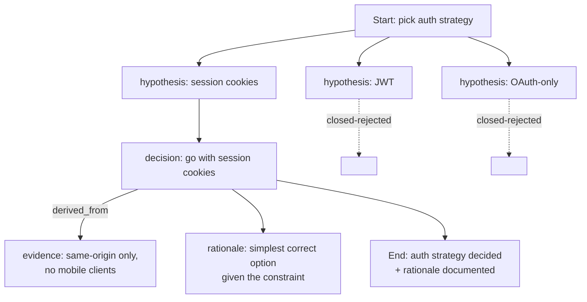
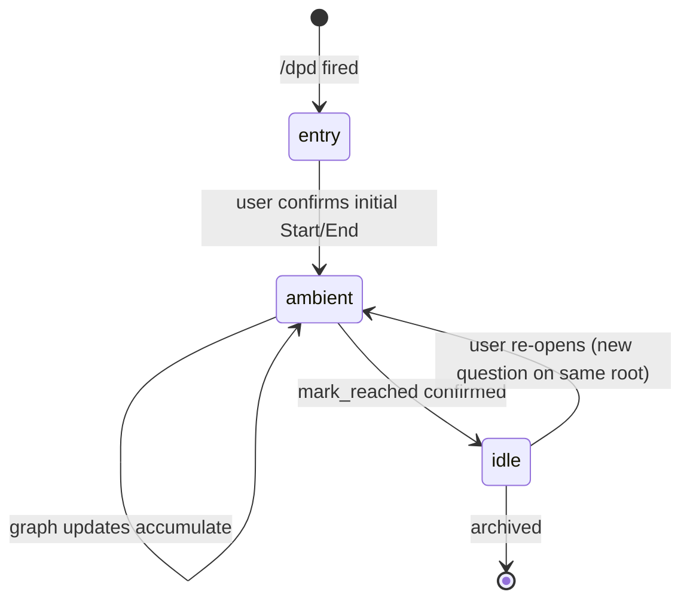

# DPD — Decompose-Propagate Decision

[日本語](README.ja.md)

A graph-based protocol for structuring AI-assisted decision dialogues.

DPD turns long, branching conversations with an AI agent into an explicit decision graph: hypotheses get parked as nodes, decisions get linked to the evidence they were derived from, and the conversation has a visible "shape" that survives context resets and resumes.

This repository is the reference implementation: an MCP (Model Context Protocol) server that stores the graph in SQLite, and a Claude Code skill that drives the conversational UX on top.

> **Status**: `0.x` — usable but pre-1.0. The protocol, MCP tool surface, and sqlite schema may still change without backward-compat shims. See [Versioning](#versioning).

---

## Why DPD?

If you've used an AI coding agent for non-trivial work, you've probably hit one of these:

- The agent and you generated three hypotheses, picked one, but the other two are now buried in the transcript and you can't tell which won.
- You agreed on a goal three hours ago; the work has drifted and nobody noticed because there's no anchor to drift *against*.
- The session got compacted and the rationale for an important decision is gone.
- The same question keeps coming up because there's no shared place to record "we already settled this."

DPD's claim: these are all symptoms of treating a conversation as a flat stream when it's actually a directed graph of decisions. Make the graph explicit and the symptoms go away.

---

## How DPD works (Readable Spec)

DPD models a conversation as a **session** containing one or more **roots** (top-level subgraphs). Each root holds:

- A **Start** node (problem statement)
- An **End** node (achievement criteria — what "done" looks like)
- Intermediate nodes: **hypothesis**, **decision**, **rationale**, **question**, **evidence**, …
- **Edges** between nodes: `derived_from`, `contributes_to`, `blocks`, …

Example fragment (a typical decision branch):



Rejected hypotheses don't disappear — they stay in the graph marked `closed`, so future "wait, did we consider X?" questions have an answer.

### Session lifecycle

Sessions move through three modes:



- **entry** — bootstrap phase: agree on the goal, build the initial Start → End skeleton, classify any existing conversation material.
- **ambient** — steady-state: the user converses normally, the agent observes and *proposes* graph updates at natural pauses ("here's what I'd record from the last five minutes — apply?"). Custodial tone, not transactional.
- **idle** — the End condition has been reached; the root is settled. Reopen it explicitly to add more.

### Pool (parking lot)

Not every observation has an obvious place to attach. The **Pool** is an unstructured parking lot for items the agent isn't sure where to put. Pool items can later be:

- **Elevated** into the graph (with explicit edges to existing nodes)
- **Rejected** (with a recorded reason — and the agent won't re-propose the same item)
- **Dropped** (no decision, just removed)

Items are deduplicated by a canonical-text hash, so "this is the same suggestion you already rejected" is detectable, not nagging.

### End narrowing & the drift gate

The **End** is the subgraph's anchor. The skill aggressively *narrows* it on entry — if the goal text mentions three or more distinct outcomes, the agent proposes splitting into multiple Ends. The narrower the End, the more accurately you can detect drift later.

Once confirmed, the End is **gated**: the agent will not silently expand its `achievement_conditions` or rewrite its text. Any change requires explicit user confirmation. This is what prevents the "agent quietly redefines 'done' to match what it already did" failure mode.

---

## Built agent-driven, with DPD

This implementation was developed in an unusual loop: the protocol was designed *while running DPD sessions to track its own design decisions*. The same hypothesis-rejection, evidence-linking, End-narrowing, and drift-detection mechanisms described above were used by the maintainers (and the AI agent collaborating with them) to decide what DPD itself should be.

Concretely:

- The v0.3 → v0.3.1 amendment cycle ran as a DPD session. Open hypotheses about ambient-mode triggers, Pool semantics, and End-modification rules were attached as nodes; rejected variants are still visible in the historical graph.
- The "End modification gate" (§5.0 of the dev spec) was added *after* a self-validation run surfaced cases where the agent had silently expanded an End to fit work that had already drifted past it.
- Several "self-check" rules (e.g., "before flattening N≥3 concerns into one node, consider a sub-tree") were derived from observing the agent's own failure modes during development sessions.

This isn't a curiosity. It's a deliberate test of the protocol: if DPD couldn't structure its own design conversation, it wouldn't deserve to structure yours. The graphs from that loop are also how several gaps in the early drafts were found — gaps the current implementation closes.

---

## Use cases

DPD is at its best when:

- **The conversation is exploratory or has multiple viable branches**, and you need to remember why you didn't take the others.
- **Sessions span days or are resumed by a different person**, and "what did we decide about X" needs an actual answer rather than transcript-spelunking.
- **The work involves trade-offs the user cares about** (architectural choices, scope cuts, policy decisions) — DPD makes the trade-off visible instead of letting the agent quietly pick.
- **You want a paper trail of which evidence supported which decision**, e.g., for review or compliance.

DPD is overkill when:

- The task is mechanical and well-specified (just write the code).
- The conversation is short and single-threaded.
- You don't care about resuming or auditing the decision.

---

## Quick start

Requires Python 3.11+, [Claude Code](https://docs.anthropic.com/en/docs/claude-code) (CLI), and `make`.

```bash
git clone https://github.com/o3co/agent-dpd.git
cd agent-dpd
make dev          # install venv + register with Claude Code
```

Then restart Claude Code so it picks up the new MCP server. From any project, invoke `/dpd`. The skill detects your project, asks whether to resume an existing session or start a new one, and walks you through bootstrapping a Start → End anchor.

Manual install steps (for non-Make environments) are in [AGENTS.md](AGENTS.md#setup).

### Optional: scoping a workspace

If you want the same DPD database across multiple sibling project directories (e.g., a monorepo with separate sub-projects), drop a `.dpdrc` at the workspace root:

```ini
# .dpdrc — DPD scope marker
scope=my-workspace
```

The MCP server walks up from your editor's working directory to find this marker, and uses the marker's location as the agent-scope root. Sessions and their graphs live per-agent-scope.

For sub-scope partitioning (separate session pools per sub-project within one agent scope), drop another `.dpdrc` lower in the tree with a different `scope=` value. See [AGENTS.md](AGENTS.md#sub-scope-detection-dpdrc) for details.

---

## Repository layout

```text
.
├── mcp/        MCP server (Python, stdio, sqlite) — graph state + tool API
├── skill/      Claude Code skill — conversational UX
├── docs/       Migration guides, ADRs, supplementary specs
├── Makefile    install / test / register convenience targets
├── AGENTS.md   Developer guidelines (read before contributing)
└── LICENSE     Apache 2.0
```

`mcp/` and `skill/` are designed to evolve together — the skill consumes the server's MCP tool API; the server holds no conversational state of its own.

---

## Status

This implementation reached the **v0.3.1 ambient overlay** milestone in May 2026. The protocol invariant is stable enough for daily use, but the public surface (tool names, schema, `.dpdrc` format) is still permitted to change. Each release notes its breaking changes.

The full implementation-level specification (DDL, error codes, state machine tables) lives upstream in the agent scope that hosts the protocol research; the user-facing readable spec is this README. If you need the dev spec for non-trivial contributions, ask the maintainers — graduation into this repo is planned.

---

## Versioning

Currently `0.x`. Per the convention that `0.x` carries no compat guarantees, breaking changes can land in any release — but the project still ships migrations for schema changes (see [`docs/`](docs/)) so you can move forward without rebuilding state.

`1.0` will lock the public surface: MCP tool names + signatures, `.dpdrc` schema, sqlite schema migration contract. Until then, treat compatibility as best-effort and read the release notes.

---

## License & contributing

Apache 2.0 — see [LICENSE](LICENSE). Copyright © 2026 [1o1 Co. Ltd.](https://1o1.co.jp/)

Contributions welcome. Read [AGENTS.md](AGENTS.md) before opening a PR — it covers TDD discipline, the multi-agent review process, and conventions specific to this repo (including the rule that the `LICENSE` file is never AI-generated).
