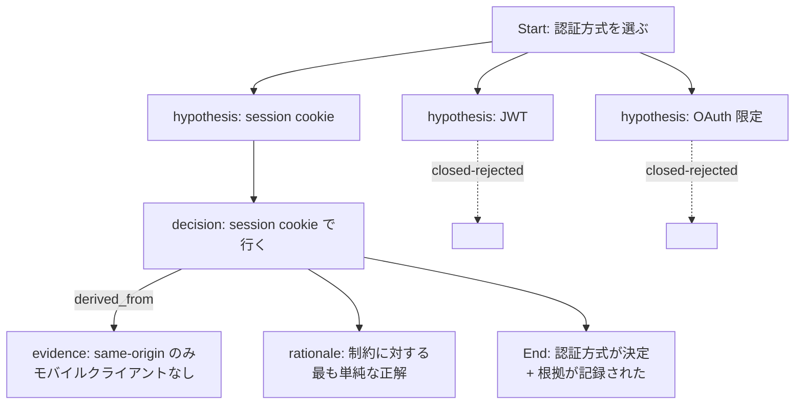
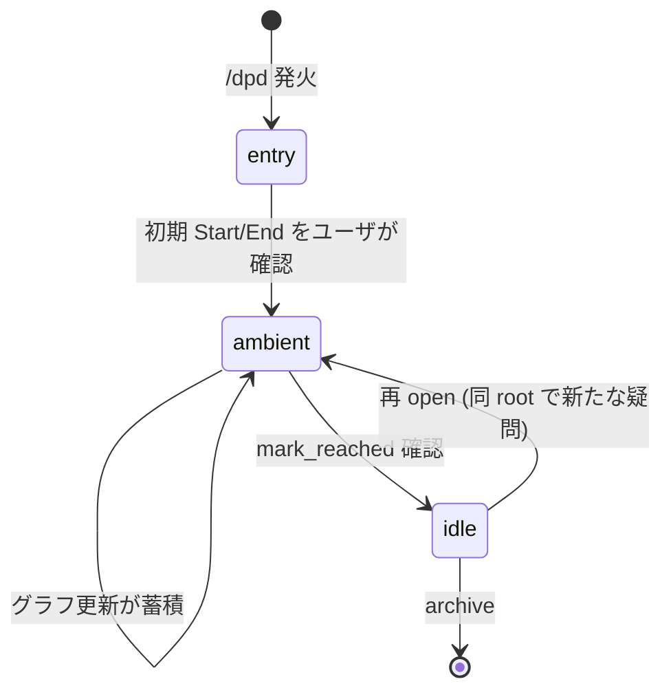

# DPD — 概念と設計

[English](concept.md)

DPD は何か、なぜ存在するか、グラフはどう動くか、プロトコルがどう開発されたか。ツールの *why* を知りたい人向け。インストールやコマンドリファレンスは top-level の [README.ja.md](../README.ja.md) を参照。

## なぜ DPD?

AI コーディング・エージェントを non-trivial な作業に使ったことがあるなら、以下のいずれかは経験済みのはず:

- エージェントと一緒に仮説を 3 つ出して 1 つを選んだが、残り 2 つはトランスクリプトに埋もれて、どれが採用されたかすら追えなくなった。
- 3 時間前にゴールを合意したが、作業はずれていき、誰もそれに気付かない — drift する基準がないから。
- セッションが compact されて、重要な決定の根拠が消えた。
- 同じ質問が繰り返し浮上する — 「もう決着済み」を記録する共有の場がないから。

DPD の主張: これらはすべて「対話を flat なストリームとして扱う」ことの症状で、実態は「意思決定の有向グラフ」である。グラフを明示すれば症状は消える。

---

## DPD はどう動くか

DPD は対話を **session** としてモデル化し、その中に 1 つ以上の **root** (top-level の subgraph) を持つ。各 root は次を含む:

- **Start** ノード (問題の宣言)
- **End** ノード (達成条件 — 「完了」とは何か)
- 中間ノード: **hypothesis** / **decision** / **rationale** / **question** / **evidence** …
- ノード間の **edge**: `derived_from` / `contributes_to` / `blocks` …

典型的な意思決定分岐の例:



却下された仮説は消えない — `closed` としてグラフに残るので、「待って、X は検討した？」という未来の質問にちゃんと答えられる。

### Session lifecycle

Session は 3 つのモードを遷移する:



- **entry** — bootstrap フェーズ: ゴールを合意し、初期 Start → End の骨格を作り、既存の対話素材を分類する。
- **ambient** — 定常状態: ユーザは普通に対話を続け、エージェントはバックグラウンドで観察し、自然な区切りで graph 更新を *提案* する (「ここまでの 5 分で記録したいのはこれです、適用しますか?」)。custodial なトーン、transactional ではない。
- **idle** — End 条件が達成され root が settle した状態。明示的に reopen しない限り追加しない。

### Pool (parking lot)

すべての観察が明確な attach 先を持つわけではない。**Pool** は「どこに付けるか不明」な item を一時 park する unstructured な場所。Pool item は後で以下のように扱える:

- **Elevate** — 既存ノードへの explicit edge と共にグラフに昇格
- **Reject** — 理由を記録して却下 (以後エージェントは同じ提案を再発しない)
- **Drop** — 判断せずに削除

Item は canonical text hash で重複判定されるので、「これ前に却下したのと同じ」が detectable で、nag にならない。

### End 絞り込みと drift gate

**End** は subgraph の anchor。skill は entry 時に積極的に End を *narrow* する — ゴール文に 3 つ以上の outcome が混在していたら、End 分割を提案する。End が narrow であるほど drift 検出の精度が上がる。

確定後、End は **gated**: エージェントは `achievement_conditions` を勝手に拡張したり text を書き換えたりしない。変更には明示的なユーザ確認が必要。これが「エージェントが暗黙裡に End を再定義して既に終わった作業に整合させる」という failure mode を防ぐ。

---

## DPD で、Agent-Driven に作られた

DPD はちょっと変わったループで開発された: プロトコル設計そのものが *DPD session で自身の設計判断を記録しながら* 進められた。特に v0.3.1 リリースは spec を DPD 自身の gap 検出パイプラインに通した literal な self-validation pass から生まれた。

### Self-validation パイプライン

v0.3.1 spec draft がほぼ完成した時、以下の 3 ステップ・パイプラインに通した:

```text
/dpd-import path/to/your-spec.md
    └─ spec の prose を archived subgraph として import
       (各番号付きセクションがノード、見出しが edge を暗示)

/dpd-fill
    └─ *推論ノード* を生成: 欠けた decomposition、未明示の前提、
       spec が暗示するが明言しない claim。各推論ノードは
       provenance='inferred' でマークされ、保持には opt-in が必須。

/fcot  (opt-in; high-stakes 推論ノードでのみ自動)
    └─ 1 ノードに Falsification Chain-of-Thought を適用、
       既存グラフ + spec text から *反証* を試みる。
       判定: confirmed / falsified / unable_to_decide。
```

`/fcot` は `/dpd-fill` / `/dpd-import` が生成した high-stakes 推論ノードに対しては自動実行される。low-stakes ノードでは optional — 特定 node に追加の厳密性を求めたい時だけ呼び出し、誤推論のコストが低い時はスキップする。verification の過剰実行は ambient overlay 哲学を壊す (`docs/spec` §10)。

`/fcot` が `/dpd-fill` の過剰生成を捕まえる。今回の実行では high-confidence 推論ノード 6 個のうち 4 個が falsified — もっともらしく見えたが spec がすでにカバーしていた。残り 2 個が real gap だった:

- **A1**: §9.1.1 状態遷移行が `entry → idle on /dpd-abort` だったが、`/dpd-abort` は実際には定義された skill ではなかった — プロトコル意図は「ユーザの明示的 abort 宣言」。Wording を修正。
- **B2**: §3.2.1 はエージェントが End 分割を提案すべきと言っていたが、その *機構* (separate root spawn vs sub-tree) を定義していなかった。§5.3 End modification gate を canonical な split 経路として参照することで解決。

両方の fix は commit [`f1de6aa`](https://github.com/o3co/agent-dpd/commit/f1de6aa) で ship。

### なぜこれが重要か

Self-validation は余興ではない — DPD が *自分が主張すること* を本当にできるかのテスト。ユーザが頼ることになるメカニズム (hypothesis 却下、End 絞り込み、drift 検出、Pool reject identity) は、人の対話に使う前にまず spec 自身の構造で機能する必要があった。

ループから生まれた他のアーティファクト:

- 「End modification gate」は、self-validation 実行中にエージェントが既に drift した作業に合わせて End を黙って拡張していたケースを surface した *後で* 追加された。
- いくつかの self-check ルール (例: 「N≥3 の異なる懸念を 1 ノードに flatten する前に sub-tree を検討する」) は、開発 session 中にエージェント自身の failure mode を観察して導出された。

同じパイプラインを自分の spec や設計文書に適用できる。`/dpd-import → /dpd-fill → /fcot` は systematic な gap 分析の documented パターンの 1 つで、`/fcot` は high-stakes 推論ノードに対しては自動、それ以外は optional のため、3 段目のコストは求める厳密性に応じてスケールする。

---

## Status と versioning

この実装は 2026 年 5 月に **v0.3.1 ambient overlay** マイルストーンに到達した。プロトコル不変条件は日常利用に耐える程度に安定しているが、public surface (tool 名、schema、`.dpdrc` 形式) は引き続き変更されうる。各リリースは breaking change を release note に明記する。

現状 `0.x`。`0.x` は compat 保証なしという慣行に従い、breaking change はどのリリースにも入りうる — ただしスキーマ変更には migration を必ず添える。state を作り直さずに進める。

`1.0` で public surface を固定: MCP tool 名 + シグネチャ、`.dpdrc` schema、sqlite schema migration contract。それまでは互換性は best-effort、release note を必ず読むこと。

---

## 実装 spec

実装レベルの完全 spec (DDL、エラーコード、state machine 表) は protocol 研究を hosting する upstream の agent scope に存在する。本リポへの graduation は計画中。non-trivial な contribution で必要ならメンテナに依頼を。
