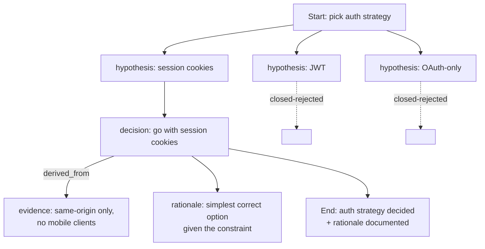
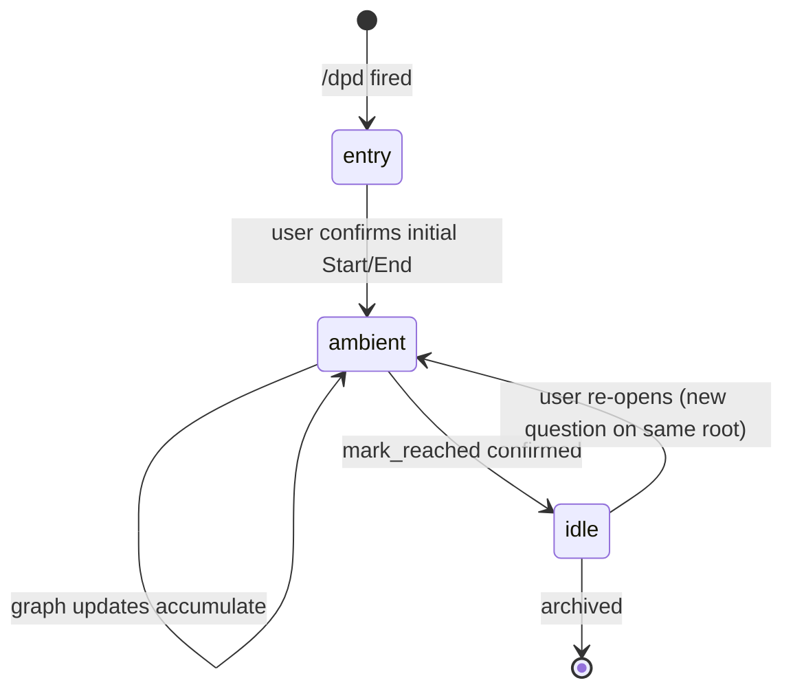

# DPD — Concept and design

[日本語](concept.ja.md)

What DPD is, why it exists, how the graph works, and how the protocol was developed. Read this if you want the *why* behind the tool. For getting started and command reference, see the top-level [README.md](../README.md).

## Why DPD?

If you've used an AI coding agent for non-trivial work, you've probably hit one of these:

- The agent and you generated three hypotheses, picked one, but the other two are now buried in the transcript and you can't tell which won.
- You agreed on a goal three hours ago; the work has drifted and nobody noticed because there's no anchor to drift *against*.
- The session got compacted and the rationale for an important decision is gone.
- The same question keeps coming up because there's no shared place to record "we already settled this."

DPD's claim: these are all symptoms of treating a conversation as a flat stream when it's actually a directed graph of decisions. Make the graph explicit and the symptoms go away.

---

## How DPD works

DPD models a conversation as a **session** containing one or more **roots** (top-level subgraphs). Each root holds:

- A **Start** node (problem statement)
- An **End** node (achievement criteria — what "done" looks like)
- Intermediate nodes: **hypothesis**, **decision**, **rationale**, **question**, **evidence**, …
- **Edges** between nodes: `derived_from`, `contributes_to`, `blocks`, …

Example fragment (a typical decision branch):



Rejected hypotheses don't disappear — they stay in the graph marked `closed`, so future "wait, did we consider X?" questions have an answer.

### Session lifecycle

Sessions move through three modes:



- **entry** — bootstrap phase: agree on the goal, build the initial Start → End skeleton, classify any existing conversation material.
- **ambient** — steady-state: the user converses normally, the agent observes and *proposes* graph updates at natural pauses ("here's what I'd record from the last five minutes — apply?"). Custodial tone, not transactional.
- **idle** — the End condition has been reached; the root is settled. Reopen it explicitly to add more.

### Pool (parking lot)

Not every observation has an obvious place to attach. The **Pool** is an unstructured parking lot for items the agent isn't sure where to put. Pool items can later be:

- **Elevated** into the graph (with explicit edges to existing nodes)
- **Rejected** (with a recorded reason — and the agent won't re-propose the same item)
- **Dropped** (no decision, just removed)

Items are deduplicated by a canonical-text hash, so "this is the same suggestion you already rejected" is detectable, not nagging.

### End narrowing & the drift gate

The **End** is the subgraph's anchor. The skill aggressively *narrows* it on entry — if the goal text mentions three or more distinct outcomes, the agent proposes splitting into multiple Ends. The narrower the End, the more accurately you can detect drift later.

Once confirmed, the End is **gated**: the agent will not silently expand its `achievement_conditions` or rewrite its text. Any change requires explicit user confirmation. This is what prevents the "agent quietly redefines 'done' to match what it already did" failure mode.

---

## Built agent-driven, with DPD

DPD was developed in an unusual loop: the protocol was designed *while running DPD sessions to track its own design decisions*. The v0.3.1 release in particular came out of a literal self-validation pass — running the spec through DPD's own gap-detection pipeline.

### The self-validation pipeline

When the v0.3.1 spec draft was almost done, we ran it through this three-step pipeline against itself:

```text
/dpd-import scopes/dev.dpd/docs/dpd-v0.3.1-draft.md
    └─ imports the spec prose as an archived subgraph
       (each numbered section becomes a node, headings imply edges)

/dpd-fill
    └─ asks the agent to generate *inferred* nodes: missing decompositions,
       unstated assumptions, claims the spec implies but doesn't state.
       Each inferred node is marked provenance='inferred' and requires
       explicit opt-in to keep.

/fcot
    └─ runs Falsification Chain-of-Thought over each inferred node,
       attempting to *disprove* it from the existing graph + the spec text.
       Verdicts: confirmed / falsified / unable_to_decide.
```

`/fcot` is what catches the over-eager `/dpd-fill`. In our run, 4 of 6 high-confidence inferred nodes were falsified — they sounded plausible but the spec already covered them. The remaining 2 were real gaps:

- **A1**: §9.1.1 state-transition row read `entry → idle on /dpd-abort`, but `/dpd-abort` wasn't actually a defined skill — the protocol meant "user explicit abort declaration." Wording amended.
- **B2**: §3.2.1 said the agent should propose End splits but didn't define the *mechanism* (separate root spawn vs sub-tree). Resolved by referencing §5.3 End modification gate as the canonical split path.

Both fixes shipped in commit [`f1de6aa`](https://github.com/o3co/agent-dpd/commit/f1de6aa).

### Why this matters

Self-validation isn't a curiosity — it's a test of whether DPD can actually *do what it claims*. The same mechanisms users will rely on (hypothesis rejection, End narrowing, drift detection, Pool reject identity) had to work on the spec's own structure before we'd trust them on your conversation.

Other artifacts from the loop:

- The "End modification gate" was added *after* a self-validation run surfaced cases where the agent had silently expanded an End to fit work that had already drifted past it.
- Several self-check rules (e.g., "before flattening N≥3 concerns into one node, consider a sub-tree") were derived from observing the agent's own failure modes during development sessions.

You can run the same pipeline on your own specs or design documents — `/dpd-import → /dpd-fill → /fcot` is the documented pattern for systematic gap analysis.

---

## Status and versioning

This implementation reached the **v0.3.1 ambient overlay** milestone in May 2026. The protocol invariant is stable enough for daily use, but the public surface (tool names, schema, `.dpdrc` format) is still permitted to change. Each release notes its breaking changes.

Currently `0.x`. Per the convention that `0.x` carries no compat guarantees, breaking changes can land in any release — but the project still ships migrations for schema changes so you can move forward without rebuilding state.

`1.0` will lock the public surface: MCP tool names + signatures, `.dpdrc` schema, sqlite schema migration contract. Until then, treat compatibility as best-effort and read the release notes.

---

## Implementation spec

The full implementation-level specification (DDL, error codes, state machine tables) lives upstream in the agent scope that hosts the protocol research. Graduation into this repository is planned. If you need it for non-trivial contributions, ask the maintainers.
