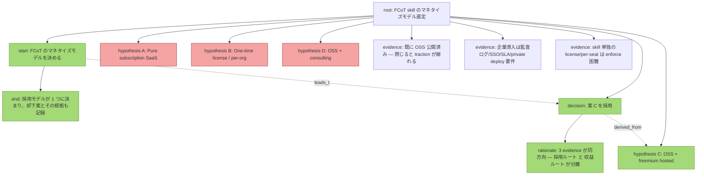
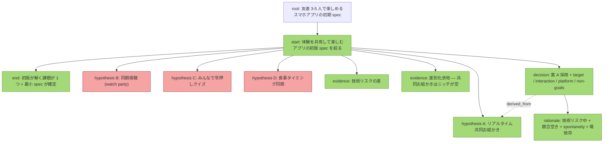

# DPD — detailed examples

Worked examples showing how a DPD session actually plays out. Each example is reproducible — the graphs shown here were built by running the actual MCP tools, then exported with `export_mermaid`.

For the protocol concept and lifecycle, see [`concept.md`](concept.md). For the command cheatsheet, see the top-level [`README.md`](../README.md).

---

## Example 1 — Decide a monetization model

**Scenario**: an open-source AI skill (FCoT — Falsification Chain-of-Thought) is already published on GitHub. The author needs to decide *how* to monetize it without killing the OSS adoption it depends on.

### Conversation

```text
You: FCoT を OSS で出してから半年で community が育ってきた。マネタイズ方法を決めたい。
     /dpd
DPD: 提案するアンカー:
       Start: FCoT skill のマネタイズモデルを決める
       End:   採用モデルが 1 つに決まり、却下案とその根拠も記録されている
       (achievement_conditions:
         - 採用モデルが 1 つに絞られている
         - 却下案それぞれに却下理由が紐づいている
         - 決定 + rationale ノードが存在する)
     適用しますか？
You: yes
DPD: [Start + End anchor created]
     ambient モードに入りました。

[しばらく議論。候補として浮上するモデル、市場慣行など]

DPD: 候補が 4 案出揃いました。記録します:
       - 仮説 A: Pure subscription SaaS — FCoT 全機能を月額 hosted で
       - 仮説 B: One-time license / per-org enterprise — 企業ごとに 1 回課金
       - 仮説 C: OSS + freemium hosted — skill 本体は OSS、有料 hosted 層を追加
       - 仮説 D: OSS + consulting — skill 無料、導入支援で収益
     適用しますか？
You: yes、出揃った感じ

[さらに議論。事実関係を整理]

DPD: 3 つの evidence を記録します:
       - "FCoT は既に OSS 公開済み — 事後的に閉じると traction が崩れる"
       - "企業導入には監査ログ/SSO/SLA/private deploy が必須 — OSS 単体では満たせず"
       - "skill 単独の license / per-seat 課金は技術的にも文化的にも enforce 困難"
     適用しますか？
You: yes

[決め所]

You: 案 C で行こう。OSS は手放さず、hosted 層で価値交換が成立する形に。
DPD: 確認します:
       - 決定: 案 C (OSS + freemium hosted) を採用
       - 根拠: 3 つの evidence が同じ方向を指している。価値交換層 (= hosted SaaS) に
              課金、コア技術は OSS のまま保つ — 採用ルートと収益ルートが分離して衝突しない
       - 仮説 A, B, D を却下として close (derived_from edge: 決定 → 仮説 C)
     End 条件を満たしました。mark_reached?
You: yes
DPD: [mark_reached] subgraph closed。
```

### Resulting graph



### What you get from this

- The chosen model (C) and the **three rejected alternatives are each preserved with reasons** — so when someone later asks "why didn't we go with a per-org license?", the answer is already in the graph.
- The `derived_from` edge from the decision to hypothesis C records *which hypothesis won* (not just "we decided C").
- `/dpd-summary-md` on this session produces a markdown digest you can drop straight into a strategy document.
- If a new constraint surfaces later (e.g., a regulator forbids hosted versions for your sector), reopen the session, add evidence, and re-evaluate — the rejected branches are right there to revisit.

---

## Example 2 — Narrow a vague idea into a minimum spec

**Scenario**: a vague "I want to build a phone app for hanging out with friends" gets narrowed, through DPD, into a single first-version spec with explicit non-goals.

This example shows the *casual-conversation → /dpd → narrowing → spec* flow, which is where DPD's End-narrowing pressure earns its keep.

### Conversation

```text
You: 友達 3-5 人で気軽に遊べるスマホアプリ作りたいんだけど、何作るかで悩んでて。
     案としてはこんなのが浮かんでる:
       - リアルタイム共同お絵かき (24h で消える)
       - 同期視聴 (友達と同時に YouTube とか)
       - 早押しクイズ (party game 系)
       - 食事タイミング同期 (せーので乾杯系)
     /dpd
DPD: ゴール "友達と楽しめる" は広いです — narrowing を提案します:
       Start: 友達 3-5 人で「リアルタイムに体験を共有して楽しむ」スマホアプリを作りたい
       End:   初版が解く課題が 1 つに絞られ、最小スコープ仕様
              (target user / core interaction / 出荷 platform / 明示的な non-goals) が確定
     適用しますか？
You: yes
DPD: [anchor created] ambient モードへ。

[案を hypothesis として全部 park。質問しながら絞っていく]

DPD: 4 案を仮説として登録しました。次は絞り込みの判断材料を集めましょう。

[技術リスクと差別化を議論]

DPD: 2 つの evidence を記録します:
       - 技術リスク差: 共同お絵かき = WebRTC/CRDT で中難度、同期視聴 = 著作権/帯域で高、
                       早押しクイズ = 問題コンテンツ調達が継続コスト、食事同期 = UX 設計が肝
       - 差別化余地: 同期視聴/早押しクイズは大手 (Discord/Kahoot) と直接競合。
                     共同お絵かきは spontaneous な遊びの場として既存サービス少なくニッチが空いている
     適用しますか？
You: yes

[決め所]

You: 案 A (共同お絵かき) で行く。target は LINE で既に繋がってる仲、出荷は iOS から、
     最初は AI 補正も公開フィードも課金もなし。
DPD: 決定を整理します:
       - 決定: 案 A (リアルタイム共同お絵かき) 採用
         target: LINE 等で既に繋がる 3-5 人グループ
         core interaction: 1 枚のキャンバスに同時書き込み + 24h で消える
         platform: iOS から
         non-goals: 公開フィード / AI 補正 / 課金 / 6 人以上対応 (= v0.2 以降)
       - 根拠: 技術リスク中 + ニッチが空 + spontaneity がゲームの本質
              (同期視聴/クイズは "コンテンツ依存"、共同お絵かきは "場依存")
       - 案 B, C, D を rejected として close
     End 条件達成、mark_reached?
You: yes
DPD: [mark_reached]
```

### Resulting graph



### What you get from this

- The vague "friend app" goal got narrowed to a single first-release spec. Three plausible alternatives sit in the graph as rejected, with reasons.
- The decision itself carries **structured spec content** (target user / core interaction / platform / non-goals). It's not just "we picked A" — it's "we picked A with these dimensions".
- Non-goals are first-class in the decision text. This is the difference between a spec and a wishlist.
- When v0.2 planning starts, the `non-goals` list ("AI 補正 / public feed / monetization / 6+ users") is the natural backlog. Each can be opened as a new root in a fresh DPD session.

---

## Example 3 — Validate a spec for consistency and completeness

**Scenario**: you have a written spec draft. You want a systematic way to find gaps before review, beyond eyeball reading.

This is the **`/dpd-import → /dpd-fill → /fcot`** pipeline. DPD itself was validated this way before each release — the [agent-driven origin story](concept.md#built-agent-driven-with-dpd) in `concept.md` walks through the actual findings from the v0.3.1 self-validation pass (4/6 false positives filtered out, 2 real gaps surfaced and fixed).

The short version:

```text
You: 仕様ドラフトができた。漏れがないか機械的にチェックしたい。
     /dpd-import docs/my-spec.md
DPD: [spec を archived subgraph として取り込み — 各セクションがノード化]

You: /dpd-fill
DPD: 推論ノードを生成しました (n 個)。
     各候補は provenance='inferred' でマーク済み、保持には opt-in 必要。

You: /fcot
DPD: 各推論ノードに反証 chain-of-thought を回します。
     結果: x/n falsified (spec が既にカバー済み)、y/n confirmed (real gap)
     real gap を「対応 TODO」として記録しますか？
```

The interesting part is **`/fcot` filtering out the over-eager `/dpd-fill`**. Inferred nodes that sound plausible but are already addressed by the spec get marked `falsified` and dropped. What survives is the actual list of holes worth fixing.

For the concrete findings on DPD's own v0.3.1 spec (A1: `/dpd-abort` reference to undefined skill, B2: End-split mechanism undefined), see [`concept.md`](concept.md#built-agent-driven-with-dpd).

---

## Example 4 — Multi-agent dev workflow across sessions

**Scenario**: a large implementation plan needs to be executed by multiple Claude Code agent sessions because each individual session runs out of context before finishing. You want the handoff between agents to be reliable: agent 2 needs to know exactly where agent 1 left off, what's done, what's open, and which tangents were parked.

> **Note**: this example is partially conceptual — the multi-agent handoff itself can't be run inside a single dogfooded session here. The graph construction part (importing a spec, generating a TODO subgraph, validating with `/dpd-fill`) is the same machinery as Example 3; what's new is using the session as a *coordination surface* between agents.

### Pattern

```text
Step 1 — Plan ingestion (any agent, before starting work):

You: /dpd-import docs/feature-x-spec.md
DPD: [spec をアーカイブ subgraph として取り込み]

You: 開発 TODO に変換したい。spec から各タスクを抽出して active subgraph として spawn して。
DPD: [新規 root を spawn。spec の各セクションを TODO ノードとして登録]

You: /dpd-fill
DPD: 推論ノード生成 — spec が暗示するが未明示のタスク候補:
       - "DB migration が必要 (schema 変更が含まれるため)"
       - "feature flag を導入する必要"
       - "監視ダッシュボードに metric を追加"
     /fcot で反証チェックしますか?
You: yes
DPD: [/fcot 適用] 3 個中 1 個 falsified、2 個 real gap として保持。
You: 保持した 2 つを TODO に追加。

Step 2 — Agent A starts implementing:

You: /dpd-status
DPD: [active TODO ノード一覧、未着手 12 個、進行中 0]

[agent A が個別ノードに focus、close_node で完了マーク、ambient で新たな問題を Pool に park]
[セッション後半で context 残量が減ってくる]

You: そろそろ context 切れそう。今の状況を次の agent に引き継ぐ準備をして。
DPD: focus は今 node_xxx (実装中: API endpoint 設計)。
     残り open: 7 ノード。Pool に新規観察 3 件 (route validation, error code 統一,
     test fixture の改修)。次 agent 向けに /dpd-status の出力を残しておきます。

Step 3 — Agent B resumes in a fresh session:

You: /dpd
DPD: 既存 session あり: "feature-x 実装"
     mode = ambient、focus = node_xxx (API endpoint 設計、進行中)
     未着手 7、Pool 3 (route validation, error code 統一, test fixture の改修)
     (a) 続ける  (b) 別 session を始める  どちらにしますか？
You: a
DPD: [resume] focus_node が前回の作業文脈を復元しました。
     /dpd-status で詳細を確認できます。
```

### Why DPD fits this

- **Session resume gives agent B exact context**, not a vague handoff note. `focus_node`, open TODOs, parked Pool items are all preserved.
- **No coordination protocol invented per project** — the same /dpd machinery handles single-session, multi-day, and multi-agent flows.
- **Pool catches tangents safely**. Agent A noticing "route validation needs work" doesn't have to interrupt the current task or drop the observation — `pool_add` parks it for agent B (or a later session) to triage.
- **`/dpd-summary-md` produces a clean handoff doc** if you ever want a human-readable snapshot to attach to a PR or share with a stakeholder.

For the same approach applied to validating the plan rather than executing it, see Example 3.
