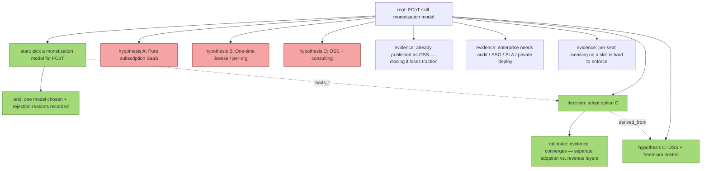
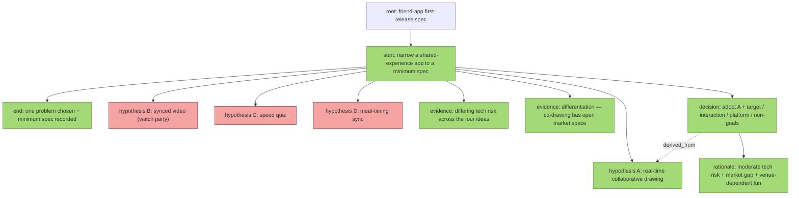

# DPD — detailed examples

Worked examples showing how a DPD session actually plays out. Each example is reproducible — the graphs shown here were built by running the actual MCP tools, then exported with `export_mermaid`.

For the protocol concept and lifecycle, see [`concept.md`](concept.md). For the command cheatsheet, see the top-level [`README.md`](../README.md).

---

## Example 1 — Decide a monetization model

**Scenario**: an open-source AI skill (FCoT — Falsification Chain-of-Thought) is already published on GitHub. The author needs to decide *how* to monetize it without killing the OSS adoption it depends on.

### Conversation

```text
You: I open-sourced FCoT six months ago, and community usage is growing.
     I want to decide a monetization model without killing the OSS adoption
     I depend on.
     /dpd
DPD: Proposing this anchor:
       Start: Decide a monetization model for the FCoT skill
       End:   One model is chosen, with rejection reasons recorded for the others
       (achievement conditions:
         - one model picked
         - each rejected option has a reason attached
         - decision + rationale nodes exist)
     Apply?
You: yes
DPD: [Start + End anchor created]
     Entering ambient mode.

[some discussion: candidate models, market norms, comparable products]

DPD: I'd like to record four hypotheses for the candidate models:
       - hypothesis A: Pure subscription SaaS — all FCoT functionality
                       behind a monthly hosted service
       - hypothesis B: One-time license / per-org enterprise — one charge
                       per organization, unlimited internal use
       - hypothesis C: OSS + freemium hosted — skill itself stays OSS,
                       paid hosted layer adds team/audit/SLA value
       - hypothesis D: OSS + consulting — skill stays free, revenue from
                       deployment support and training
     Apply?
You: yes, that's the full set as far as I can think.

[discussion continues — surfacing the constraints]

DPD: Three evidence nodes:
       - "FCoT is already published as OSS — retroactively closing it would
          sacrifice the early traction"
       - "Enterprise adoption requires audit logs / SSO / SLA / private deploy,
          which the OSS skill alone cannot satisfy — a hosted layer is needed"
       - "Per-seat / per-skill licensing is hard to enforce both technically
          (the code is a copyable repo) and culturally"
     Apply?
You: yes

[deciding]

You: Let's go with C. Keep the OSS, monetize the hosted layer.
DPD: Confirming:
       - decision: hypothesis C (OSS + freemium hosted) adopted
       - rationale: the three evidence nodes all point the same way. Money
                    moves at the layer where actual value is exchanged
                    (= hosted SaaS); the core stays open. Adoption channel
                    and revenue channel are separate, so they don't collide.
       - hypotheses A, B, D close as rejected
         (derived_from edge: decision → hypothesis C)
     End conditions satisfied. mark_reached?
You: yes
DPD: [mark_reached] subgraph closed.
```

### Resulting graph



### What you get from this

- The chosen model (C) and the **three rejected alternatives are each preserved with reasons** — so when someone later asks "why didn't we go with a per-org license?", the answer is already in the graph.
- The `derived_from` edge from the decision to hypothesis C records *which hypothesis won* (not just "we decided C").
- `/dpd-summary-md` on this session produces a markdown digest you can drop straight into a strategy document.
- If a new constraint surfaces later (e.g., a regulator forbids hosted versions for your sector), reopen the session, add evidence, and re-evaluate — the rejected branches are right there to revisit.

---

## Example 2 — Narrow a vague idea into a minimum spec

**Scenario**: a vague "I want to build a phone app for hanging out with friends" gets narrowed, through DPD, into a single first-version spec with explicit non-goals.

This example shows the *casual-conversation → /dpd → narrowing → spec* flow, which is where DPD's End-narrowing pressure earns its keep.

### Walkthrough

```text
You: I want to build a phone app that small groups of friends (3–5) can
     enjoy casually. Ideas floating around:
       - real-time collaborative drawing (24h-disappearing canvas)
       - synced video watching (watch parties)
       - speed quiz (party game style)
       - "say cheers at the same time" food sync app
     /dpd
DPD: The goal "an app to enjoy with friends" is very broad — proposing
     to narrow it:
       Start: A phone app for 3–5 friends to share a real-time experience
       End:   The first-release problem is narrowed to one, and a minimum
              spec is set (target user / core interaction / launch platform /
              explicit non-goals)
     Apply?
You: yes
DPD: [anchor created] entering ambient mode.

[four candidate ideas get parked as hypotheses]

DPD: All four candidates are now hypotheses under the Start. Next we need
     material to narrow it down.

[discussion of technical risk and differentiation]

DPD: Two evidence nodes:
       - "Tech risk varies: co-drawing = WebRTC/CRDT, medium; synced video =
          rights + bandwidth, high; quiz = ongoing content sourcing cost;
          food sync = UX design is the hard part, tech is light"
       - "Co-drawing has open space in the market — synced video and quiz
          compete head-on with established players (Discord, Kahoot).
          Spontaneous-drawing-with-friends is underserved."
     Apply?
You: yes

[deciding]

You: Let's go with A (co-drawing). Target: 3–5 friend groups already
     connected on chat apps. Ship on iOS first. No AI features, no public
     feed, no monetization in v1.
DPD: Recording the decision with its spec dimensions:
       - decision: hypothesis A (real-time collaborative drawing) adopted
         target: friend groups (3–5) already connected via existing chat apps
         core interaction: shared canvas with simultaneous strokes, 24h decay
         platform: iOS first
         non-goals: public feed / AI assistance / monetization /
                    6+ user support (= v0.2 backlog)
       - rationale: tech risk is moderate (achievable) + market gap (no
                    direct competitor) + the "spontaneity" of drawing is
                    venue-dependent rather than content-dependent
                    (synced video and quiz need a constant content supply;
                    drawing just needs friends present together)
       - hypotheses B, C, D close as rejected
     End conditions satisfied. mark_reached?
You: yes
DPD: [mark_reached]
```

### The resulting structure



### What this gives you

- The vague "friend app" goal got narrowed to a single first-release spec. Three plausible alternatives sit in the graph as rejected, with reasons.
- The decision itself carries **structured spec content** (target user / core interaction / platform / non-goals). It's not just "we picked A" — it's "we picked A with these dimensions".
- Non-goals are first-class in the decision text. This is the difference between a spec and a wishlist.
- When v0.2 planning starts, the recorded non-goals (AI assistance / public feed / monetization / 6+ users) are the natural backlog. Each can be opened as a new root in a fresh DPD session.

---

## Example 3 — Validate a spec for consistency and completeness

**Scenario**: you have a written spec draft. You want a systematic way to find gaps before review, beyond eyeball reading.

This is the **`/dpd-import → /dpd-fill → /fcot`** pipeline. DPD itself was validated this way before each release — the [agent-driven origin story](concept.md#built-agent-driven-with-dpd) in `concept.md` walks through the actual findings from the v0.3.1 self-validation pass (4/6 false positives filtered out, 2 real gaps surfaced and fixed).

The short version:

```text
You: Spec draft is done. I want to check it for gaps mechanically, not just
     by eyeballing it.
     /dpd-import docs/my-spec.md
DPD: [imported the spec as an archived subgraph — each section becomes a node]

You: /dpd-fill
DPD: Generated N inferred nodes (missing decompositions, unstated
     assumptions, claims the spec implies but doesn't state).
     Each carries provenance='inferred' and needs explicit opt-in to keep.

You: /fcot
DPD: Running falsification chain-of-thought against each inferred node.
     Results: x/n falsified (already covered by the spec),
              y/n confirmed (real gap).
     Record the real gaps as TODOs?
```

The interesting part is **`/fcot` filtering out the over-eager `/dpd-fill`**. Inferred nodes that sound plausible but are already addressed by the spec get marked `falsified` and dropped. What survives is the actual list of holes worth fixing.

For the concrete findings on DPD's own v0.3.1 spec (A1: `/dpd-abort` reference to undefined skill, B2: End-split mechanism undefined), see [`concept.md`](concept.md#built-agent-driven-with-dpd).

---

## Example 4 — Multi-agent dev workflow across sessions

**Scenario**: a large implementation plan needs to be executed by multiple Claude Code agent sessions because each individual session runs out of context before finishing. You want the handoff between agents to be reliable: agent 2 needs to know exactly where agent 1 left off, what's done, what's open, and which tangents were parked.

> **Note**: this example is partially conceptual — the multi-agent handoff itself can't be run inside a single dogfooded session here. The graph construction part (importing a spec, generating a TODO subgraph, validating with `/dpd-fill`) is the same machinery as Example 3; what's new is using the session as a *coordination surface* between agents.

### Pattern

```text
Step 1 — Plan ingestion (any agent, before starting work):

You: /dpd-import docs/feature-x-spec.md
DPD: [imported the spec as an archived subgraph]

You: Convert this into a development TODO. Pull each task out of the spec
     and spawn an active subgraph for it.
DPD: [spawned a new root; each spec section is registered as a TODO node]

You: /dpd-fill
DPD: Generated inferred TODOs — tasks the spec implies but doesn't state:
       - "DB migration needed (schema change involved)"
       - "Feature flag required"
       - "Metric needs to be added to the monitoring dashboard"
     Run /fcot to falsify-check these?
You: yes
DPD: [/fcot applied] 1 of 3 falsified, 2 kept as real gaps.
You: Add the surviving two to the TODO list.

Step 2 — Agent A starts implementing:

You: /dpd-status
DPD: [active TODO nodes: 12 not started, 0 in progress]

[agent A focuses on individual nodes, closes them as completed, parks new
 observations into Pool as they surface]
[late in the session, context starts running low]

You: I'm about to run out of context. Prep a handoff for the next agent.
DPD: Current focus: node_xxx (in progress: API endpoint design).
     Remaining open: 7 nodes. Pool now has 3 new observations
     (route validation, error code unification, test fixture refactor).
     The /dpd-status output is preserved for the next agent to pick up.

Step 3 — Agent B resumes in a fresh session:

You: /dpd
DPD: Found an existing session: "feature-x implementation"
     mode = ambient, focus = node_xxx (API endpoint design, in progress)
     7 open, 3 pool items (route validation, error code unification,
     test fixture refactor)
     (a) Continue  (b) Start a new session
You: a
DPD: [resume] focus_node restored to where the previous agent left off.
     Use /dpd-status to see details.
```

### Why DPD fits this

- **Session resume gives agent B exact context**, not a vague handoff note. `focus_node`, open TODOs, parked Pool items are all preserved.
- **No coordination protocol invented per project** — the same /dpd machinery handles single-session, multi-day, and multi-agent flows.
- **Pool catches tangents safely**. Agent A noticing "route validation needs work" doesn't have to interrupt the current task or drop the observation — `pool_add` parks it for agent B (or a later session) to triage.
- **`/dpd-summary-md` produces a clean handoff doc** if you ever want a human-readable snapshot to attach to a PR or share with a stakeholder.

For the same approach applied to validating the plan rather than executing it, see Example 3.
